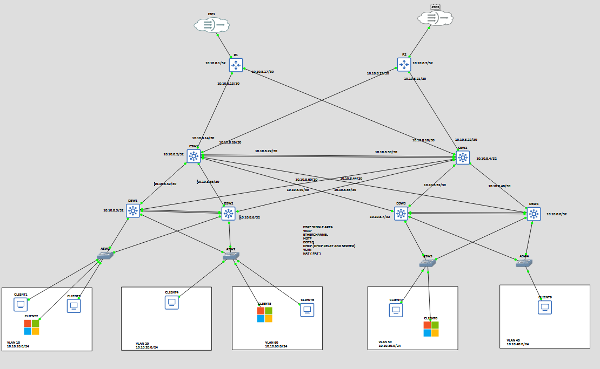

# Enterprise Campus Network — Documentation

**Project Type:** Network Design & Implementation (Lab Simulation)
**Platform:** GNS3 (Arista vEOS, MikroTik CHR)
**Status:** Implemented and functionally tested

---

## 1. Project Overview

This project simulates a redundant, segmented enterprise campus network using a three-tier hierarchical design (core / distribution / access). The goal was to build a network that could realistically exist inside a mid-size organization — with departmental segmentation, redundant paths at every layer, centralized services (DHCP, NAT), and restricted management access — rather than a flat, single-path lab topology.

The network was built and tested in GNS3 using Arista vEOS for routing/switching and MikroTik CHR for edge routing, with connectivity validated through interface failure simulations rather than just static configuration review.

---

## 2. Network Topology

**Layer breakdown:**

| Layer | Devices | Role |
|---|---|---|
| Edge | R1, R2 | Internet-facing routers, one per ISP uplink (ISP1 / ISP2) |
| Core | CSW1, CSW2 | Full-mesh redundant core, interconnected via EtherChannel |
| Distribution | DSW1, DSW2, DSW3, DSW4 | Dual-homed to both core switches; host VRRP gateways |
| Access | ASW1, ASW2, ASW3, ASW4 | End-client connectivity, VLAN trunking to distribution |

Every distribution switch connects to **both** core switches, and both core switches connect to **both** edge routers — eliminating any single point of failure between the internet edge and the access layer.

---

## 3. Design Objectives

The topology was built against a set of requirements modeled on a real small-to-mid-size enterprise:

- **No single point of failure** at the core, distribution, or internet edge
- **Departmental network segmentation** by VLAN, with controlled inter-VLAN routing
- **Centralized, automatic IP assignment** across all client VLANs, including subnets not directly attached to a DHCP server
- **Redundant internet connectivity** via two independent uplinks

---

## 4. Network Addressing Plan

### 4.1 Client VLANs

| VLAN ID | Subnet | Hosts | Purpose |
|---|---|---|---|
| 10 | 10.10.10.0/24 | Client1, Client2 | Department segment |
| 20 | 10.10.20.0/24 | Client4 | Department segment |
| 30 | 10.10.40.0/24 | Client9 | Department segment |
| 40 | 10.10.40.0/24 | Client7, Client8 | Department segment |
| 60 | 10.10.60.0/24 | Client3, Client6 | Department segment |

### 4.2 Infrastructure Addressing (Loopbacks)

Point-to-point links between routing devices use a `/30` VLSM scheme carved out of a dedicated `10.10.8.0/24` infrastructure block, with each Layer 3 device also assigned a `/32` loopback used for OSPF router-ID stability and management reachability.

| Device | Loopback (Router ID) |
|---|---|
| R1 | 10.10.8.1/32 |
| CSW1 | 10.10.8.2/32 |
| R2 | 10.10.8.3/32 |
| CSW2 | 10.10.8.4/32 |
| DSW1 | 10.10.8.5/32 |
| DSW2 | 10.10.8.6/32 |
| DSW3 | 10.10.8.7/32 |
| DSW4 | 10.10.8.8/32 |

---

## 5. Technology Implementation

### 5.1 OSPF (Single Area)

All Layer 3 infrastructure (R1, R2, CSW1, CSW2, DSW1–4) runs OSPF in a single area, providing dynamic reachability between loopbacks, transit links, and client VLAN subnets. A single area was sufficient given the network's size — multi-area OSPF would add administrative complexity without a corresponding benefit at this scale.

Each edge router redistributes/advertises a default route (`0.0.0.0/0`) into OSPF, so internal devices automatically learn internet reachability without static routes on every internal node.

### 5.2 VLAN Segmentation & 802.1Q Trunking

Client traffic is segmented into six VLANs (see addressing table above) by department/function. Access switches carry single-VLAN access ports to end devices; uplinks between access → distribution → core are configured as 802.1Q trunks carrying only the VLANs required on each link (not a blanket allow-all), reducing unnecessary broadcast propagation.

### 5.3 Inter-VLAN Routing

Inter-VLAN routing is performed at the distribution layer (Switched Virtual Interfaces on DSW1–4), keeping the core layer focused purely on fast, redundant transit rather than routing policy — a standard three-tier design principle.

### 5.4 VRRP (First-Hop Redundancy)

Each client VLAN's default gateway is a VRRP virtual IP shared across a pair of distribution switches. If the active (master) distribution switch fails, the standby takes over the gateway IP with no reconfiguration required on end clients.

### 5.5 EtherChannel (Link Aggregation)

Parallel physical links between core switches (CSW1 ↔ CSW2) are bundled into a single logical Port-Channel interface. This provides both increased throughput and resilience — a single link failure within the bundle doesn't drop the adjacency, unlike relying on OSPF equal-cost multipath alone across separate interfaces.

### 5.6 MSTP (Multiple Spanning Tree Protocol)

MSTP is used instead of plain STP/RSTP to prevent Layer 2 loops across the redundant access/distribution links while allowing different VLANs to use different forwarding topologies (load-balancing traffic across redundant uplinks by VLAN group, rather than blocking one uplink entirely for all VLANs).

### 5.7 DHCP Server & DHCP Relay

DHCP service is centralized on the edge routers (R1/R2) rather than distributed per-VLAN, with **DHCP relay** configured on each distribution switch's SVI to forward client DHCP requests from remote VLANs back to the central server. Handed-out DNS points to the internal Active Directory server, integrating IP assignment with domain services.

### 5.8 NAT (PAT)

R1 and R2 each perform NAT with port address translation (PAT) on their ISP-facing interfaces, allowing all internal private addressing (10.10.0.0/16 range) to share the two public-facing uplinks. This is appropriate for the network's actual requirement — outbound-only internet access, with nothing internally hosted that needs to be reachable from the internet.

---

## 6. High Availability & Redundancy Design

| Failure Point | Redundancy Mechanism |
|---|---|
| ISP uplink | Dual ISP connections (R1 → ISP1, R2 → ISP2), OSPF-distributed default route |
| Core switch | CSW1/CSW2 full-mesh to routers and distribution layer |
| Distribution switch / gateway | VRRP active/standby pair per VLAN |
| Core interconnect | EtherChannel-bundled links (survives single-link failure) |
| Layer 2 loops | MSTP blocks/forwards per-VLAN-group to prevent loops while retaining redundant paths |

---

## 7. Design Decisions Considered but Not Implemented

- **BGP:** Not implemented. BGP's value is in advertising owned public IP space or providing automatic multi-path traffic engineering between Autonomous Systems. Since this network only requires outbound internet access (no public-facing services to advertise), a static/OSPF-distributed default route to each ISP meets the actual requirement without the operational complexity BGP would add.
- **GRE over IPsec:** Not implemented. This pattern solves site-to-site connectivity with encrypted transport for a dynamic routing protocol — relevant if a second physical site needed to be connected. This project's scope is a single site, so it wasn't applicable.
- **QoS:** Not implemented. QoS addresses contention between traffic types with different latency/priority sensitivity (e.g., voice vs. bulk data). This network carries only general client data traffic on a fully switched LAN with no identified congestion or latency-sensitive traffic class, so there was no contention problem for QoS to solve.

---
